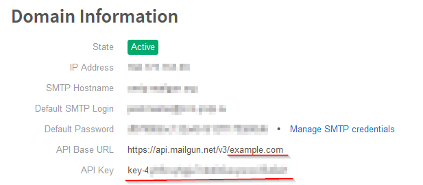

# Logging.ExceptionSender

`ExceptionSenderMiddleware` watches for unhandled exceptions. When found - details are saved to text files in specific folder.

`ExceptionSenderTask` monitors that folder and sends exception info to you by email (using [MailGun.com][3])

Written for **ASP.NET vNext** (ASP.NET 5, ASP.NET Core 1) projects.

## Main features

* Exception message and stacktrace are saved;
* Last N log records saved ([Logging.Memory][1] is used);
* Files are saved in `logs` subdirectory for later processing;
* Task (based on [RecurrentTasks][2]) is used for checking new exception data;
* Every single exception - one email to you;
* [MailGun][3] is used to send emails (free quota 10K emails/month);
* When new exception is caught - tries to send immediately
* When message sucessfully sent - files are deleted from disk
* Send message to several recipients (multiple `To`)

## Usage

### 1. Register at MailGun.com

Register your site at [MailGun.com][3] and write down your domain name and api key:

### 2. Initialize in `Startup.cs`

In your `Statup.cs` you sould:

* Enable `MemoryLogger` via `loggerFactory.AddMemory()`
* Enable `ExceptionSender` via `app.UseExceptionSender()`

        public void Configure(IApplicationBuilder app, ILoggerFactory loggerFactory...)
        {
            ...
            loggerFactory.AddMemory();
            ...
            app.UseExceptionSender(o =>
            {
                o.MailgunDomain = "example.com"; // your domain name at mailgun.com
                o.MailgunApiKey = "key-4..."; // your api key at mailgun.com
                o.From = new System.Net.Mail.MailAddress("Logging.ExceptionSender@example.com");
                o.To = new[] 
                { 
                    new System.Net.Mail.MailAddress("youraddress@example.com") 
                };
            });
            ...
        }

## Installation

Use NuGet package [Logging.ExceptionSender](https://www.nuget.org/packages/Logging.ExceptionSender)

### Dependencies

* Microsoft.AspNet.Http.Abstractions
* Microsoft.Extensions.OptionsModel
* Microsoft.Extensions.PlatformAbstractions
* [Logging.Memory][1]
* [RecurrentTasks][2]
* [RestSharp](http://restsharp.org/)

## Version history

* 1.0.0 (Feb 8, 2016)
  * Initial release

[1]: https://github.com/iflight/Logging
[2]: https://github.com/justdmitry/RecurrentTasks
[3]: https://www.mailgun.com